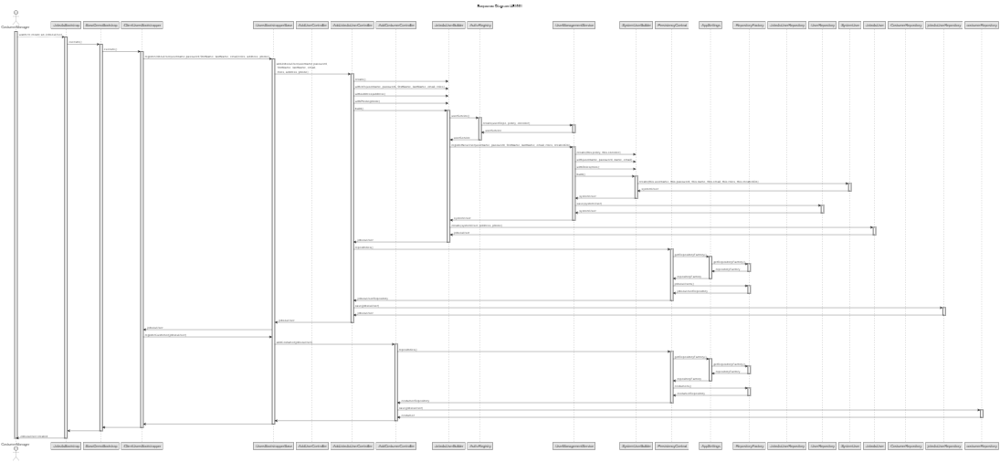
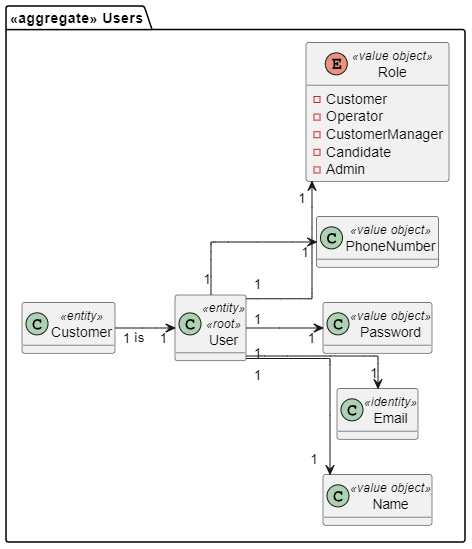

# US 1001 - As Customer Manager I want to register a customer and that the system automatically creates a user for that custome

## 1. Context
### 1.1. User Story Description

Alternatively this can be achieved by a bootstrap process.

### 1.2. Customer Specifications and Clarifications

* Question : Q19 Diogo – Na criação de um utilizador no sistema o nome é definido pelo utilizador ou é o nome da pessoa (primeiro e último) e se a password é definida pelo utilizador ou gerada pelo sistema?
    * Answer : A19 No âmbito da US 2000a o Operator cria utilizadores do sistema para candidatos que ainda não estejam no sistema. Tem de fazer isso com base nos dados recebidos na candidatura (que incluem email e nome). O email servirá para identificar a pessoa. Neste contexto é necessário ter uma password para esse novo utilizador. Uma vez que essa informação não é transmitida pelo candidato, suponho que a solução mais “aconselhada” será o sistema gerar uma password para esse utilizador. Como o utilizador/candidato irá receber essa informação (a forma de autenticação na app) está out of scope, no sentido em que não existe nenhuma US que remete para isso. As US 1000 e 1001 também remetem para criação de utilizadores. Aqui, eventualmente poderia-se pensar em introduzir manualmente as passwords, mas pode ser pelo mesmo mecanismo de definição automática de password, descrito anteriormente. Relativamente ao nome ver novamente a Q11.

* Question : Q11 Matilda – No enunciado não está explicita a informação a recolher para os Customers? Qual a informação necessária? E quando aos funcionários da empresa?
    * Answer : A11 De facto isso não está explicito. No entanto, são referidos no nome da empresa e o seu endereço no âmbito de um job opening. Quanto aos utilizadores (representante da empresa que acede à Customer App) eu diria que serão dados similares ao do Candidate. Quando aos funcionários da empresa, eu diria que é importante garantir que é usado o email para identificar qualquer utilizador do sistema. Penso que será importante para cada utilizador termos o nome completo assim como um short user name (que deverá ser único). Actualização em 2024-03-21: O Product Owner reconsiderou e decidiu que o short user name é dispensável uma vez que para autenticação dos utilizadores se deve usar apenas o email e a password.

* Question : Q104 Rui – US1001 – A criação de uma conta para o customer é feita ao inserir manualmente o email e nome do customer ou é expectavel ter uma lista de customers não registados no sistema para usar?
    * Answer : A104 Não percebi bem o conceito de customers não registados. Penso que esse conceito não existe. A US 1001 indica que se pretende registar um customer. Ao registar-se o customer deve-se também criar um utilizador para que o customer possa aceder à App de customers.

* Question : Q111 Sergio – US1001 - Regras de negócio para endereço do customer- Quais são as regras de negócio do endereço do customer?
    * Answer : A111 (Nota: evitem fazer perguntas muito genéricas e técnicas). Se me perguntar se é suficiente, nesta fase, que o sistema aceite apenas endereços nacionais, a minha resposta é afirmativa. Se a pergunta era outra, por favor coloque de novo, desta vez como se estivesse a falar com alguém que não sabe o que são regras de negócio, mas é especialista no negócio.

* Question : Q122 Dias – US 1001 - E-mail atribuído ao Customer- Na US 1001 é pedido que a criação de um User através da CustomerEntity criada seja automática. Contudo, para a criação de um User é necessário um e-mail. Permite que seja pedido um e-mail ao Manager, para ficar associado á entidade? A password já será gerada automaticamente, por isso seria também possível a geração automática de um e-mail.
    * Answer : A122. Para essa US faze sentido assumir que o Customer Manager conhece o email a ser suado para esse Customer e pode introduzi-lo. Tal como para outras situações similares podem assumir que a password é gerada pelo sistema e que existe uam forma do utilizador conhecer essa password, mas que está forá do âmbito actual do sistema. Não percebi à referência a CustomerEntity. O que é?

* Q135 Sofia – US1001 - Customer Code - Relativamente ao formato do customer code, em todos os exemplos fornecidos, este é uma sigla/acrónimo com letras maiúsculas (ex: "ISEP", "IBM"). Só pode ter este formato ou pode conter números e letras minúsculas?
    * A135. Ver Q22. Em Q22 sugere-se 10 caracteres no máximo. Penso que seria de manter apenas letras maiúsculas podendo ainda ter dígitos (0-9), mas começando sempre por letra.

* Q22 João – Relativamente ao Job Opening (secção 2.2.2), o job reference refere que deve ser gerado pelo sistema a partir de um customer code. O que é este customer code e se existe alguma regra para a sua criação?
    * A22  Eu dira que qualquer customer terá de ter um código identificativo (único) que poderá ser uma espécie de abreviatura do seu nome. Com um número limitado de caracteres. Por exemplo, para o cliente Instituto Superior de Engenharia do Porto, o customer code poderia ser ISEP e não poderia haver mais nenhum customer com este customer code. Um limite razoável seria talvez 8 a 10 carateres. Podemos definir 10. Este código é introduzido manualmente na criação do customer no sistema.

## 2. Requirements

### 2.1. Acceptance Criteria

* **AC1:** As Customer Manager, I want to have an auto generated password.

### 2.2. Found out Dependencies

This US depends on US1000.

### 2.3 Input and Output Data

**Input Data:**

The customer must have the following attributes:
* First Name - String
* Last Name - String
* Address - String
* Email - String
* Password - String
* Phone Number - String

 
**Output Data:**

A console log with successfull message for an customer creation.

A console log with error message in case of incorrect creation of an customer.

### 2.4  Sequence Diagram (SD)

## 3. Analysis

## 4. Tests

TO DO

@Test(expected = IllegalArgumentException.class)
public void ensureXxxxYyyy() {
	...
}
`

## 5. Observations

N/A