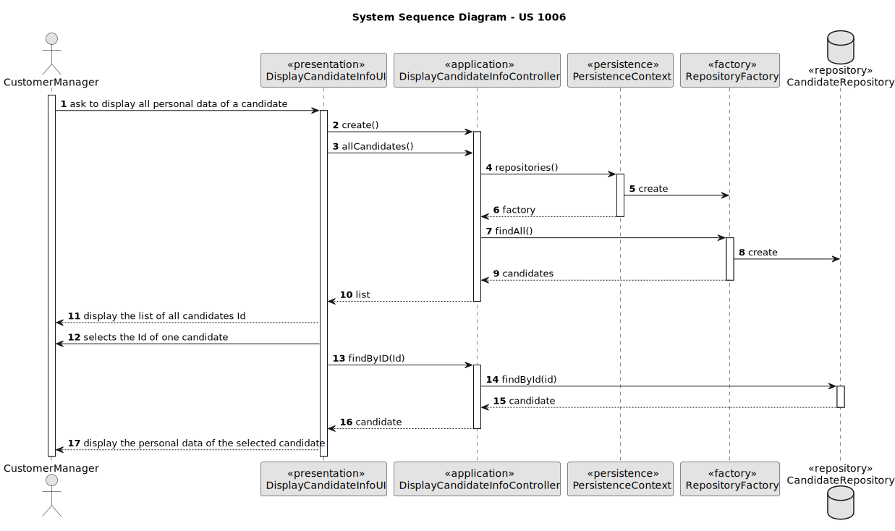

# US 1006 - As Customer Manager, I want to display all the personal data of a candidate

## 1. Context
### 1.1. User Story Description

### 1.2. Customer Specifications and Clarifications

> *Q42 Bernado* – US1006, Qual a informação do nome do candidato deve aparecer (nome completo, primeiro e ultimo nome , etc)?
>
> *A42.* À partida diria que seria o nome, tal como foi recebido na application que fez (página 6, “name of the candidate”)

> *Q75 Silva* – US1006 – Em relação à listagem dos dados pessoais de um determinado candidato, um customer manager vai ter acesso a todos os candidatos do sistema ou apenas aos candidatos que submeteram uma application para uma job opening de um cliente que é gerido por esse customer manager?
>
>*A75.* No contexto actual vamos assumir que o Customer Manager pode aceder (consultar) os dados pessoais de qualquer candidato.

> *Q90 Matilde* - US1006 – Em relação ao processo de selecionar um candidato e mostrar a sua informação pessoal, para facilitar a procura de um candidato especifico. Faria sentido perguntar ao utilizador se quer listar todos os candidatos existentes ou se quer reduzir a lista, selecionando um job opening e assim mostrar todos os candidatos para esse job opening, e por fim selecionar um candidato dessa lista mais pequena?
>
>*A90.* O product owner espera que o sistema aplique as melhores práticas de UI/UX mas, não sendo especialista nessa área técnica, não arrisca sugerir soluções.

> *Q113 Beatriz* - US1006 - Informações do candidato - Na us1006 é necessário mostrar os dados pessoais dos candidatos. Para isso, que informações acha pertinente demonstrar?
>
>*A113.* Será toda a informação pessoal de um candidato que o sistema tenha registado.

> *Q128 Rocha* - US1006- Na us 1006, seria aceitavel perguntar ao costumer manager o id do candidato de que deseja visualizar os dados, ou seria mais pertinente dar uma lista de todos os candidos e deixa-lo escolher dessa lista, assumindo que este não tem maneira de saber o id do candidato de que quer obter dados.
>
>*A128.*Pergunta similar à anterior Q127. Note-se que a US1005 permite obter as candidaturas para uma job opening. Esta US é para mostrar os dados de um candidato. Portanto parece existir forma de aceder ao id do candidato, caso não se saiba qual é. Mais uma vez, espero que apliquem boas práticas de UI/UX.

## 2. Requirements

### 2.1. Acceptance Criteria

* *AC1:* It is necessary to have at least one registered candidate before display the candidate corresponding data.

### 2.2. Found out Dependencies

* There is a dependency with US 2000a. Because it is necessary to have registered candidates before display the candidate´s data.

### 2.3 Input and Output Data

*Input Data*
* ID

*Output Data:*
* Display the candidate corresponding data.

### 3.  Sequence Diagram (SD)

## 4. Observations

N/A

