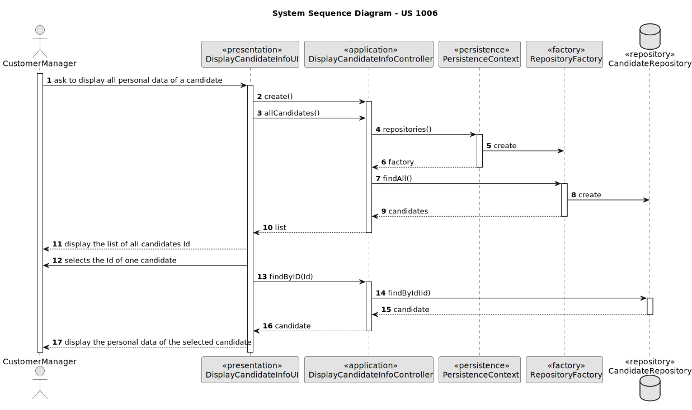

# US 1006 - As Customer Manager, I want to display all the personal data of a candidate

## 1. Context
### 1.1. User Story Description

### 1.2. Customer Specifications and Clarifications

> *Q108 José – US1006b- Quanto á informação que é apresentada na 1006b, que tipo de informação relacionada ás "applications" do candidato espera que seja apresentada ao customer manager?
>
> *A108 Espera-se que sejam listadas as candidaturas desse candidato indicando a que job opening, qual a data de registo da candidatura, o seu estado e qual o seu identificador

## 2. Requirements

### 2.1. Acceptance Criteria

* *AC1:* It is necessary to have at least one registered candidate before display the candidate corresponding data.

### 2.2. Found out Dependencies

* There is a dependency with US 2000a. Because it is necessary to have registered candidates before display the candidate´s data.

### 2.3 Input and Output Data

*Input Data*
* ID

*Output Data:*
* Display the candidate corresponding data.

### 3.  Sequence Diagram (SD)

## 4. Observations

N/A

