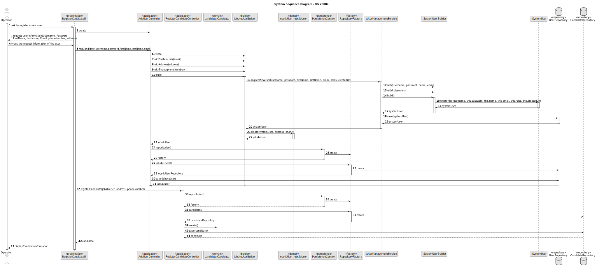

# US 2000a - As Operator, I want to register a candidate and create a corresponding user

## 1. Context
### 1.1. User Story Description

* This user story allows operators to register candidates and create their corresponding user.

### 1.2. Customer Specifications and Clarifications

> **Question 17:** Relativamente à secção 2.2.1, é na fase de Analysis que as entrevistas são avaliadas e é esse resultado que define o ranking dos candidatos? Além disso, para que serve o CV nesta fase? Visto que as entrevistas não são obrigatórias, o que acontece quando estas não se realizam?
>
> **Answer 17:**  A pontuação das entrevistas é efetuada/calculada na fase das entrevistas. O CV e outros dados (como o resultado das entrevistas) é usado pelo Customer manager na fase de analise para ordenar os candidatos. Mas a ordenação é da responsabilidade do Customer Manager (por exemplo, não tem de seguir a ordem da pontuação nas entrevistas). A US 1013 corresponde à ordenação manual dos candidatos feita pelo Customer Manager. O facto de não haver entrevistas não tem implicações na ordenação dos candidatos pois esta não depende explicitamente das entrevistas.

> **Question 19:** "Na criação de um utilizador no sistema o nome é definido pelo utilizador ou é o nome da pessoa 
(primeiro e último) e se a password é definida pelo utilizador ou gerada pelo sistema?"
> 
> **Answer 19:** "No âmbito da US 2000a o Operator cria utilizadores do sistema para candidatos que ainda não 
estejam no sistema. Tem de fazer isso com base nos dados recebidos na candidatura (que incluem email e nome). 
O email servirá para identificar a pessoa. Neste contexto é necessário ter uma password para esse novo utilizador. 
Uma vez que essa informação não é transmitida pelo candidato, suponho que a solução mais “aconselhada” será o 
sistema gerar uma password para esse utilizador. Como o utilizador/candidato irá receber essa informação 
(a forma de autenticação na app) está out of scope, no sentido em que não existe nenhuma US que remete para isso. 
As US 1000 e 1001 também remetem para criação de utilizadores. Aqui, eventualmente poderia-se pensar em introduzir 
manualmente as passwords, mas pode ser pelo mesmo mecanismo de definição automática de password, descrito 
anteriormente. Relativamente ao nome ver novamente a Q11."

> **Question 23:** A mudança de estado é referente ao candidato ou à candidatura individual e como se 
relaciona com o enable/disable dos utilizadores?
>
> **Answer 23:** O enable/disable dos users é apenas para controlar os acessos ao sistema. O estado, 
no processo de candidatura, é o estado da candidatura de um candidato a um job opening, não está diretamente 
relacionado com o enable/disable dos users.

> **Question 32:** "Os candidatos também têm estados associados? À medida
  que o processo avança, o estado do candidato também é atualizado?"
> 
> **Answer 32:** "O estado é da candidatura. O avanço no processo pode não levar a “avanço” numa
      candidatura pois, por exemplo, no final do screening a candidatura pode ser rejeitada e,
      nesse caso, essa candidatura termina ai. Outras candidatura seguem o processo."

> **Question 33:** O candidato tem um código identificativo ou é o email que o identifica?
> 
> **Answer 33:** A identificação do candidato é por email. Não haverá necessidade de um código.

> **Question 54:** Regarding the US2000a requirement which states "As an Operator, 
I want to register a candidate and create a corresponding user," I would like to know how a candidate 
will be registered in the system, i.e., understand the processes for registering a candidate. Since the candidate 
has their name, email, and phone number, how should their username be formatted to avoid conflicts with other
candidates' names? Additionally, how should the candidate be notified of their username and password?
> 
> **Answer 54:** There is no need for a user name (See Q11). Regarding the password, I think the system can 
generate a unique password. You may assume the candidate will be informed of his/her password by means that 
are outside of the scope of what is to be developed for this version of the system.

> **Question 57:** Quais às politicas de negócio para registar um candidato, quais as caracteristicas da password, 
email, telemóvel?
> 
> **Answer 57:** Sobre o telemóvel, seguir o Q56. Sobre email, seria qualquer email válido. Sobre a password,
podemos seguir algo como: ter no mínimo 8 caracteres, letras maiúsculas e minúsculas, dígitos e pelo menos, 
um caracter não alfanumérico.

> **Question 74:** US2000a – Relativamente ao registo dos candidatos, os dados devem ser inseridos manualmente 
ou importados do ficheiro com os dados do candidato?
> 
> **Answer 74:** Faz sentido que sejam importados do ficheiro, no âmbito da US2002. Eventualmente dar a 
 possibilidade do utilizador fazer alterações, caso seja necessário. A US2000a refere-se a uma funcionalidade 
 do Operador, manualmente, registar candidatos. (Nota: resposta actualizada em 2024/04/18, a negrito)

> **Question 78:* US2000a - The operator can register a candidate: does he put the info manually or has to be read 
of the file generated by the bot? This user will appear then in the backoffice...enable as default I think. 
Then the admin, can also register manually a candidate as the operator did it? I don't understand at all the 
different between a registration of the candidate made by the admin or made by the operator.
> 
> **Answer 78:** See Q74. US2000a is for the Operator to manually register a candidate and his/her user in the 
  system. US2002 is for import of the applications from the data iin the files produced by the application file 
  bot. If the candidate does not exist, it should be created. I think there is no registration of a conadidate 
  by the admin.

## 2. Requirements

### 2.1. Acceptance Criteria

* **AC1:** The candidate's registration must include the following data: name, email, telephone number

### 2.2. Found out Dependencies

* There is no dependencies with the other user stories.

### 2.3 Input and Output Data

**Input Data:**

* Typed data: 
  * Name of the candidate;
  * Email of the candidate;
  * Phone Number of the candidate.
 

**Output Data:**
  * (In)Success of the operation

### 3. Sequence Diagram (SD)

## 4. Observations

N/A