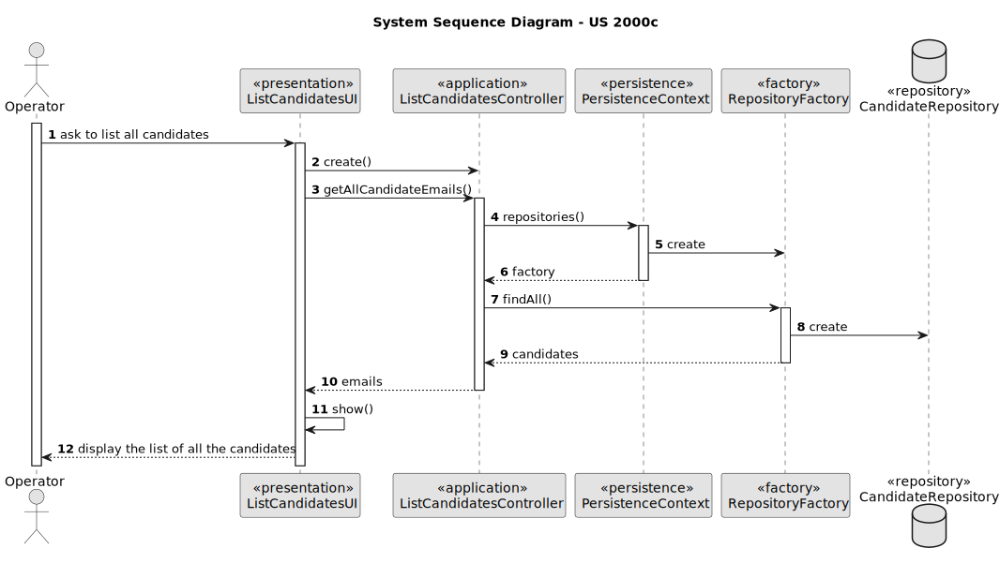

# US 2000c - As Operator, I want to list all candidates

## 1. Context
### 1.1. User Story Description

### 1.2. Customer Specifications and Clarifications

> *Q58 Alejandro* – US 2000c, quando estiver a listar os candidatos basta listar os emails?
>
> *A58.* Eu diria que faz sentido apresentar para cada candidato o seu email e o seu nome.

> *Q60 Alejandro* – Na US 2000c, existem politicas de negócio em relação a listar os candidatos?
>
>*A60.* Devem seguir eventuais condicionante relativas ao possível estado do candidato.

> *Q66 Costa – US2000c* - Ordem dos candidatos. Na US 2000c é pedido que implementemos a função de listar todos os candidatos. É necessário ordenar os candidatos (por exemplo por ordem alfabética do nome)? Se for, qual é o critério que devemos seguir?
>
>*A66.* Sim a listagem pode ser por ordem alfabética do nome.

## 2. Requirements

### 2.1. Acceptance Criteria

* *AC1:* It is necessary to have at least one registered candidate before display the list of all candidates.

### 2.2. Found out Dependencies

* There is a dependency with US 2000a. Because it is necessary to have registered candidates before list all of them.

### 2.3 Input and Output Data

*Output Data:*
* List of all the candidates

### 3. Sequence Diagram (SD)
 

## 7. Observations

N/A