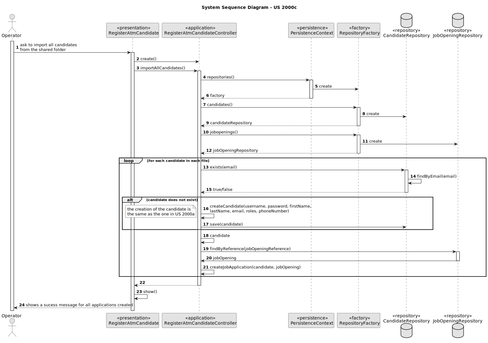

# 2002 - As Operator, I want to register an application of a candidate for a job opening and import all files received.

## 1. Context
### 1.1. User Story Description

Import the data from the file that was processed by the Application File Bot in Req 2001. The files should be kept in the shared folder, but the Backoffice application needs to know the references to the file locations.

### 1.2. Customer Specifications and Clarifications

> Q15 Ricardo – É o Operador que regista uma candidatura ou é o sistema que o faz automaticamente? E como integra o “plugin” de verificação da candidatura neste processo?
>
> A15 Na US 2002 o Operator regista a candidatura. Para isso, é o Operator que inicia o processo mas o sistema deve importar os dados resultantes do Application File Bot de forma “automática” (Ver References da US 2002). O plugin referido entra neste processo através da US 2003, em que o Operador gera um ficheiro template com os dados a introduzir para validar uma candidatura. Na US 2004, o Operador, após preencher os dados específicos da candidatura (com base no ficheiro template anterior) submete no sistema esse ficheiro que vai ser usado para o sistema avaliar/verificar a candidatura. Se os critérios não forem atingidos a candidatura é recusada

> Q65 Micael – US2002 - UI and UX. I'd like to know what is the expected flow of executing US2002 (application registration and files import, by the operator). Can you reproduce step by step which actions should the operator execute? Example: 1. The system asks the operator for the candidate's email. 2. The operator enters the candidate's email. 3. The system asks for the job reference. 4. The operator enters the job reference. 5. The system creates the job application, if there is data for it in the shared folder.
>
> A65. There are no specific requirements for the UI/UX but I think it will be more user friendly if the Operator could start the process by selecting the shared folder for the application to be imported.

> Q74 Tiago – US2000a – Relativamente ao registo dos candidatos, os dados devem ser inseridos manualmente ou importados do ficheiro com os dados do candidato?
>
>A74. Faz sentido que sejam importados do ficheiro, no âmbito da US2002. Eventualmente dar a possibilidade do utilizador fazer alterações, caso seja necessário. A US2000a refere-se a uma funcionalidade do Operador, manualmente, registar candidatos. (Nota: resposta actualizada em 2024/04/18, a negrito)

> Q78 Padilla – US2000a - The operator can register a candidate: does he put the info manually or has to be read of the file generated by the bot? This user will appear then in the backoffice...enable as default I think. Then the admin, can also register manually a candidate as the operator did it? I don't understand at all the different between a registration of the candidate made by the admin or made by the operator.
>
> A78. See Q74. US2000a is for the Operator to manually register a candidate and his/her user in the system. US2002 is for import of the applications from the data iin the files produced by the application file bot. If the candidate does not exist, it should be created. I think there is no registration of a candidate by the admin

>Q83 Leite – US2002 – Na descrição da US o PO refere uma importação de ficheiros e depois na referência à mesma a importação dos dados do ficheiro. Poderia esclarecer a que se refere a importação? São importações distintas? Têm destinos diferentes?
>
>A83. Nessa US refiro-me à importação dos ficheiros gerados pelo Application File Bot. Quando me refiro aos dados, serão os dados do ficheiro de texto “A text file with the data of the application and candidate”, secção 2.2.3, um dos ficheiros gerados.

>Q84 Leite – US2002 – Após a informação dos ficheiros que estiverem na shared folder forem utilizados pelo Operator para registar uma candidatura, devem estes permanecer na pasta ou serem eliminados? Caso não sejam apagados como determinamos quais é que ainda não foram "utilizados"?
>
>A84. Admitindo que já foram importados para o sistema, não tenho requisitos adicionais quanto aos ficheiros. A segunda pergunta é um problema que deve ser resolvido pela solução proposta. Eu não tenho nada a dizer sobre esse aspeto

>Q100 Daniela – US2002 – O que é que tem de ser registado no sistema?
>
>A100. Tem de haver um registo que indique que o candidato em questão fez a candidatura e têm de ser registados/importados para o sistema todos os ficheiros submetidos.

>Q133 Sousa – US2002- Número da candidatura- na Q24 é referido um número que identifica uma candidatura a uma job reference. Esse número é diferente em todas as candidaturas, independentemente da job reference? Poderá servir como id da candidatura?
>
>A133. Para além da Q24 veja por favor os exemplos de ficheiros disponibilizados pelo applications email bot. Sim, podemos considerar que esse número é único, nunca se repetindo.

>Q136 Padilla – US200a, US1006 - I have understood that the registration of the candidate will always be done by the operator. I also have read this line in the documentation "The Operator of the Backoffice will import the files produced by the Applications File Bot and register the applications, creating candidates that dot not exist in the system" So I guess the mechanism that the Operator follows is display all the data of a candidate (US 1006), and if the system shows "this cadidate doesn't exit", the operator click in registering candidate (US 2000A) and then he/she registers the aplication, isn't it? Apart, could the Operator upload the CV of the candidate in the registering operation? or should it be done by the candidate in his/her console?
>
>A136. Please see Q74 and all the others that refer to US2002. US2002 regards the import of the files that result from the Application File Bot. This import results in the creation of the respective applications in the system and possible creation of candidate user if it does not exist already. This is to be done automatically, without intervention of the operator. If, for some reason, the process encounters any problem (e.g., missing candidate date) it should interrupt the import a log/inform the operator. There is no US for the candidate to upload his/her CV. This is only done by email. Also, there is no US (apart from US2002) to import data from candidates.

>Q140 Pinto – US2002 – O que se entende por "and import all files received"? Devemos persistir todos os ficheiros para cada Candidate na base de dados ou apenas guardar o diretório de cada Application?
>
>A140 Aqui o termo importar deve ser visto mais como “consolidar” ou “registar” todos os ficheiros devidamente “incorporados” no sistema relativamente a uma candidatura. Normalmente isso poderia passar por importar esses ficheiros para a base de dados. No entanto, no contexto actual do projeto, pode passar apenas por registar alguma forma de acesso a esses ficheiros (por exemplo, guardando o caminho/path para os ficheiros que estão no “folder” partilhado ou outra forma similar)

## 2. Requirements

### 2.1. Acceptance Criteria

* *AC1:* It's necessary to import automatically all the files that are in the shared folder.
* *AC2:* The system should create the job application if there is data for it in the shared folder.
* *AC3:* The system should create the candidate if it does not exist in the system.
* *AC4:* The system should interrupt the import process if there is any problem (e.g., missing candidate data) and log/inform the operator.

### 2.2. Found out Dependencies

* There is a dependency with US 2001. Because it is necessary to have the files processed by the Application File Bot in the shared folder before import them.

### 2.3 Input and Output Data

*Input Data:*
* Path to the shared folder
* List of all the files in the shared folder

*Output Data:*
* List of all the files imported
* List of all the candidates created
* List of all the job applications created

### 3. Sequence Diagram (SD)
 

## 7. Observations

N/A