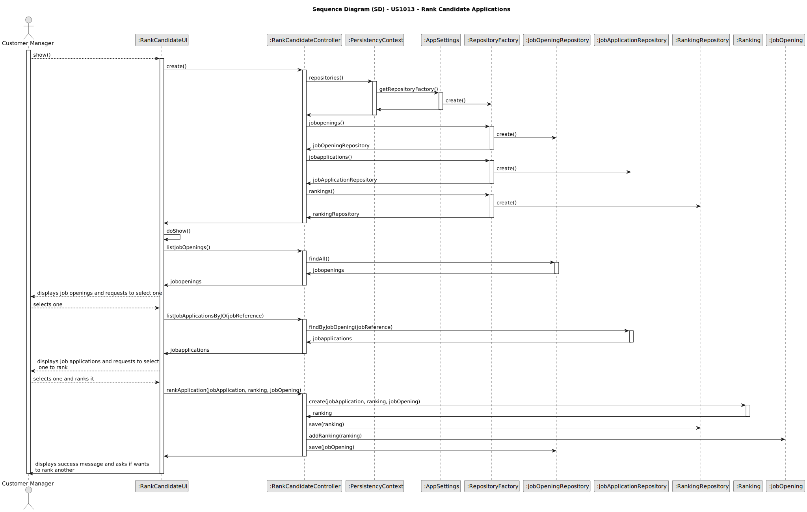

# 1013 - As Customer Manager, I want to rank the candidates for a job opening.

## 1. Context
### 1.1. User Story Description

N/a

### 1.2. Customer Specifications and Clarifications

 >* **Q17 Beatriz – Relativamente à secção 2.2.1, é na fase de Analysis que as entrevistas são avaliadas e é esse resultado que define o ranking dos candidatos? Além disso, para que serve o CV nesta fase? Visto que as entrevistas não são obrigatórias, o que acontece quando estas não se realizam?**
 A17 A pontuação das entrevistas é efetuada/calculada na fase das entrevistas. O CV e outros dados (como o resultado das entrevistas) é usado pelo Customer manager na fase de analise para ordenar os candidatos. Mas a ordenação é da responsabilidade do Customer Manager (por exemplo, não tem de seguir a ordem da pontuação nas entrevistas). A US 1013 corresponde à ordenação manual dos candidatos feita pelo >Customer Manager. O facto de não haver entrevistas não tem implicações na ordenação dos candidatos pois esta não depende explicitamente >das entrevistas.

>* **Q148 Pedro – US 1013 – A minha questão é relativa a como o ranking é feito. O customer manager dá uma nota a cada candidatura e o sistema ordena por ordem crescente sendo assim atribuído o ranking de cada candidatura? Se for assim, a nota terá que escala? Caso ainda seja assim ele só pode atribuir uma nota quando tiver conhecimento de todas? Ou pode ir colocando e o ranking só é atribuído quando todas as candidaturas já estiverem avaliadas?**
A148 Ver Q17. A ordenação dos candidatos (ranking) é da responsabilidade do customer manager. Ele pode basear-se no resultado das entrevistas e de outra informação, mas o ranking não é automático. Não há nota nem escala a usar. As candidaturas são ordenadas.

>* **Q142 Varela – US1013 - Candidate Ranking – Mr Client mention a manual ranking (Q17). If the pontuation of an interview is not essential for the candidate's rank, what criteria is to be used when ranking?**
A142 Please view again Q17. The ranking is a decision of the Customer Manager based on all the data that he/she may have during the process (including CV and other attached documents and the interviews as well as other data/information that may not be part of the system).

>* **Q155 Varela – US1013 - Rank Entries - Is there a limit on rank entries? Let's say that 100 candidates apply for a job opening. Does the Customer Manager have to sort all 100 candidates?**
A155 The order of candidates should include at least all the first candidates within the vacancy number and some following candidates. At the moment, I do not know exactly the number of the following candidates to be ordered. Therefore, I would like for it to be a global configuration property in the system. It could be a number representing a magnitude from the vacancy number. For instance, 1 could mean exactly the same number of vacancies, 2 the double, 0,5 half the number of vacancies. The remainder of the candidates could be just tagged as not ranked.

>* **Q157 Miguel – US1013 - Rank the candidates for a job Opening is the same as rank the job Applications for a Job Opening, knowing that I can only know the candidates throw the job application?**
A157 In the context of a job opening, a candidate is someone that made an application to that job opening. But the same person can be a candidate to other job openings.

>* **Q165 Varela – US1013 Clarifications - Mr. Client mentioned in Q155 that the system should have ranking configurations so that the Customer Manager doesn't have to rank all the candidates for a job opening, and that the ones that haven't been manually ranked are to be tagged with "not ranked". However, in Q162, you've said that all the candidates must be ranked before the result phase starts. Can you clarify this situation?**
A165 The customer manager must evaluate all the candidates. It is the only way he/she can produce a ranking/order for the candidates and select the “best” candidates to be included in the vacancies for the job opening. In Q155 I was only proposing a way to avoid recording in the system a lot of details that will not have any impact on the next activities. The term “not ranked” maybe is not the best. Maybe “rank not recorded” or something similar could be more appropriated.

## 2. Requirements

**AC1:** The ranking is a manual selection.

**AC2:** The raking should only be placed throw the number of vacancies.

**AC3:** There should be a config option that allows to change the magnitude upon the vancancy number.

---

**Before Ranking:**
- The costumer manager should choose one of his job openings.
- The list of application will be ordered by time of application.

**When Ranking:**
- The CM selects one candidate and gives him a rank.
- If the selected rank already exists, the other candidates will be downgraded.
- A config will be run and it will give the maximum ranking number, depending on the magnitude of the jobOpening.

**After Ranking:**
- The CM will be asked to choose to rank another candidate.
- The CM can change the job opening.

## 3. Analysis

*Sequence Diagram*

