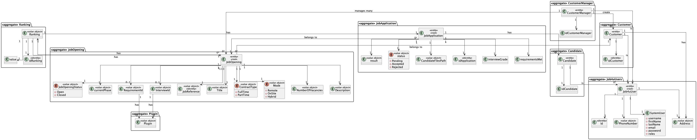

# US G006 - As Project Manager, I want the team to elaborate a Domain Model using DDD.

## 1. Context
### 1.1. User Story Description

As Project Manager, I want the team to elaborate a Domain Model using DDD. 

### 1.2. Customer Specifications and Clarifications

1. **Are there MVPs for each sprint?**

    Short answer: No.

    There are no MVPs for each sprints. There can be minimum functionality for each sprint but it depends on the team structure and composition. Professors from each UC may define minimum requirements in this context.

2. **As entrevistas são feitas presencialmente? Se sim, quem é responsável por registar essas respostas no sistema?**

    O meio usado para as entrevistas está fora do âmbito do sistema. Podem ser presenciais, remotas (ex: telefone ou outro meio). Independentemente do meio, o Customer Manager é o responsável por registar as respostas no sistema, através da submissão (upload) do ficheiro de texto com as respostas do candidato.

3. **Quem é responsável por analisar as candidaturas (applications)?**

    Será o Customer Manager. Este analisa as candidaturas e decide o ranking dos candidatos.

4. **Relativamente ao continuous integration server, o workflow irá ter de ser executado a cada push ou uma vez por dia, à noite?**

    Resposta rápida: sempre que há um push para o “main”. O processo executado pelo CI a cada push não pode exceder 2 minutos. O processo deve conseguir “compilar” o sistema, executar testes e publicar resultados sem “erros”, ou seja, não deve falhar por erros de “compilação”. No caso de haverem falhas o “responsável” pela falha (autor do commit/push) deve justificar a falha (por exemplo, justificando na sua área da documentação do repositório).

5. **Qual a distinção entre Company e Entity?**

    Quando no enunciado aparece a referência a entity é no sentido de podermos ter clientes da Jobs4u que podem não ser empresas, podem ser outro tipo de organizações.

6. **Por cada Customer, apenas existe um “representante” que acede à conta (i.e., Customer App)?**

    Sim, parece-me suficiente.

7. **No contexto em que o Customer Manager regista uma oferta de emprego, como são selecionados/definidos os requisitos para essa job offer?**

    O Customer manager regista a job opening (US 1002) e de seguida (normalmente) seleciona qual o requirements specification que é adequado a esse job opening. O requirements specification será um dos que foi “criado” pelo language engineer e registado no sistema.

8. **O email bot é referido como estando “out of scope”. Isso é referente ao sistema ou ao modelo de negócio?**

    Do ponto de vista do processo de receção de candidaturas é importante termos a noção de como são rececionadas as candidaturas e como são processadas. Dito isto, o processo automático descrito como “email bot” está fora do âmbito da solução a desenvolver, tal como ilustrado na figura 4.1.

10. **O Admin é responsável por gerir apenas Customer managers ou outros, como por exemplo Operators? E qual o significado dessa responsabilidade?**

     A ideia é que o Admin fará a gestão desses utilizadores (e no limite também dos Operators). Na prática, as US que remetem para essas funcionalidades, podem ser “substituidas” por um processo de “bootstrap” que faça inicializações na base de dados para suportar esses utilizadores/papeis (tal como mencionado no texto das US).

11. **No enunciado não está explicita a informação a recolher para os Customers? Qual a informação necessária? E quando aos funcionários da empresa?**

     De facto isso não está explicito. No entanto, são referidos no nome da empresa e o seu endereço no âmbito de um job opening. Quanto aos utilizadores (representante da empresa que acede à Customer App) eu diria que serão dados similares ao do Candidate. Quando aos funcionários da empresa, eu diria que é importante garantir que é usado o email para identificar qualquer utilizador do sistema. Penso que será importante para cada utilizador termos o nome completo assim como um short user name (que deverá ser único). Atualização em 2024-03-21: O Product Owner reconsiderou e decidiu que o short user name é dispensável uma vez que para autenticação dos utilizadores se deve usar apenas o email e a password.

12. **Qual a distinção entre especificação de requisitos e de entrevistas?**

     O “estilo” das perguntas e respostas é similar, mas nos requisitos o objetivo é avaliar o candidato e ver se tem os mínimos ou não, portanto o resultado será sim ou não. Nas entrevistas a ideia é classificar/pontuar cada resposta de forma a no final ter pontuações diferentes para os candidatos e assim ajudar a fazer o seu ranking.

13. **Um customer manager pode gerir vários clientes?**

     Sim.

14. **Quem informa o Customer manager do tipo de entrevista/perguntas?**

    Isso pode ser obtido pelo Customer manager em diálogo com o Customer. Depois disso, com a ajuda do Language engineer é elaborado o suporte para a entrevista.

15. **Ricardo – É o Operador que regista uma candidatura ou é o sistema que o faz automaticamente? E como integra o “plugin” de verificação da candidatura neste processo?**

    Na US 2002 o Operator regista a candidatura. Para isso, é o Operator que inicia o processo, mas o sistema deve importar os dados resultantes do Application File Bot de forma “automática” (Ver References da US 2002). O plugin referido entra neste processo através da US 2003, em que o Operador gera um ficheiro template com os dados a introduzir para validar uma candidatura. Na US 2004, o Operador, após preencher os dados específicos da candidatura (com base no ficheiro template anterior) submete no sistema esse ficheiro que vai ser usado para o sistema avaliar/verificar a candidatura. Se os critérios não forem atingidos a candidatura é recusada.

16. **Beatriz – Relativamente à secção 2.2.1 e às fases do processo de recrutamento, para passarmos para a fase seguinte a anterior tem de fechar ou podemos avançar sem ter a anterior fechada?**

    A resposta curta é que as fases devem ser sequenciais e não sobrepostas. Quando fecha uma fase, abre a próxima. A US 1007 prevê a definição das fases. A US 1010 prevê a abertura e fecho de fases do processo. A decisão do Customer Manager de fechar uma fase deve assumir que o processo avança para a próxima fase automaticamente (independentemente das datas definidas para as fases).

17. **Beatriz – Relativamente à secção 2.2.1, é na fase de Analysis que as entrevistas são avaliadas e é esse resultado que define o ranking dos candidatos? Além disso, para que serve o CV nesta fase? Visto que as entrevistas não são obrigatórias, o que acontece quando estas não se realizam?**

    A pontuação das entrevistas é efetuada/calculada na fase das entrevistas. O CV e outros dados (como o resultado das entrevistas) são usados pelo Customer manager na fase de análise para ordenar os candidatos. Mas a ordenação é da responsabilidade do Customer Manager (por exemplo, não tem de seguir a ordem da pontuação nas entrevistas). A US 1013 corresponde à ordenação manual dos candidatos feita pelo Customer Manager. O facto de não haver entrevistas não tem implicações na ordenação dos candidatos, pois esta não depende explicitamente das entrevistas.

18. **Beatriz – Na US 1011 como é que o Customer Manager seleciona o modelo a usar para as entrevistas?**

    Admite-se que os modelos, quando são registados no sistema (os tais “plugins”), ficam identificados com um nome ou descrição. Por exemplo, “Modelo de Entrevista para Operador de Caixa de Supermercado” ou “Modelo de Entrevista para Programador Junior Backend Java”. Na US 1011 é suposto o Customer manager selecionar um modelo de uma possível lista de modelos.

19. **Diogo – Na criação de um utilizador no sistema o nome é definido pelo utilizador ou é o nome da pessoa (primeiro e último) e se a password é definida pelo utilizador ou gerada pelo sistema?**

    No âmbito da US 2000a o Operator cria utilizadores do sistema para candidatos que ainda não estejam no sistema. Tem de fazer isso com base nos dados recebidos na candidatura (que incluem email e nome). O email servirá para identificar a pessoa. Neste contexto é necessário ter uma password para esse novo utilizador. Uma vez que essa informação não é transmitida pelo candidato, suponho que a solução mais “aconselhada” será o sistema gerar uma password para esse utilizador. Como o utilizador/candidato irá receber essa informação (a forma de autenticação na app) está out of scope, no sentido em que não existe nenhuma US que remete para isso. As US 1000 e 1001 também remetem para criação de utilizadores. Aqui, eventualmente poderia-se pensar em introduzir manualmente as passwords, mas pode ser pelo mesmo mecanismo de definição automática de password, descrito anteriormente. Relativamente ao nome ver novamente a Q11.

20. **Diogo – Uma pessoa poderá ter vários papéis no sistema?**

    Será muito difícil controlar que uma pessoa não consegue ter mais do que uma forma de acesso ao sistema (por exemplo, uma pessoa que é Customer Manager poderá ser, no limite, também uma candidato a uma oferta de emprego). Relativamente aos papéis “internos” eu diria que devemos considerar uma hierarquia de acessos. O Admin pode fazer “tudo” o que os outros fazem. Segue-se o Customer Manager e por último o Operator.

21. **João – Relativamente às Empresas, e relacionado com a Q11, o que é que significava o endereço mencionado na resposta?**

    Estava a referir-me ao endereço postal da empresa (não ao endereço email).

22. **João – Relativamente ao Job Opening (secção 2.2.2), o job reference refere que deve ser gerado pelo sistema a partir de um customer code. O que é este customer code e se existe alguma regra para a sua criação?**

    Eu diria que qualquer customer terá de ter um código identificativo (único) que poderá ser uma espécie de abreviatura do seu nome. Com um número limitado de caracteres. Por exemplo, para o cliente Instituto Superior de Engenharia do Porto, o customer code poderia ser ISEP e não poderia haver mais nenhum customer com este customer code. Um limite razoável seria talvez 8 a 10 caracteres. Podemos definir 10. Este código é introduzido manualmente na criação do customer no sistema.

23. **João Pinto – A mudança de estado é referente ao candidato ou à candidatura individual e como se relaciona com o enable/disable dos utilizadores?**

    O enable/disable dos users é apenas para controlar os acessos ao sistema. O estado, no processo de candidatura, é o estado da candidatura de um candidato a um job opening, não está diretamente relacionado com o enable/disable dos users.

24. **João Pinto – Para identificar uma candidatura usa-se o id do candidato e o id do job opening?**

    Não é bem assim. As candidaturas vão entrar no sistema através dos ficheiros gerados pelo Application Email Bot. Esses ficheiros vêm identificados pelo Job Reference seguido de um “número” que identifica a candidatura a esse job reference. Será tipicamente um número sequencial. No conteúdo desses ficheiros vai aparecer os dados do candidato. Repare-se que pode até o candidato ainda não existir (não ter registo no sistema).

25. **João Pinto – No job opening é tudo de preenchimento obrigatório ou existem opcionais?**

    Os campos referidos na secção 2.2.2 são de preenchimento obrigatório. Os requirements vão ser dinâmicos uma vez que dependem do requirements specification selecionado para aquele job opening (que se baseia numa linguagem).

## 2. Requirements

The system administrator (Admin) is responsible for managing customer entities as well as the company’s employees who are customer managers (Customer Manager). This responsibility involves registering entities as well as assigning different roles to system users (i.e., customer manager, operator). It also includes the customer’s registration as a user of the system.

Entities send job offers to Jobs4U. This sending can be done by various means (e.g. email, post, telephone), but the automation of this reception is outside the scope of the system. A customer manager will register job offers for the entities he manages in the backoffice. The customer manager will also manage other aspects of job offers, namely the entire candidate selection process. However, the registration of candidates for job offers is carried out by the operators (using some bots to automate the process).

The operator is a company employee whose main responsibility is to monitor the automatic process that registers applications for job offers. These applications are received by email and processed automatically by the Applications Email Bot (out of scope for this project). The applications Email Bot processes the emails and produces files adapted for integration in the system, that will be automatically processed by the Applications File Bot. The Operator should monitor this process, specially the report files that are produced. The Operator may, eventually, contact candidates if problems exist in their applications. The files produced by the Applications File Bot are used to integrate candidates and applications into the system.

Both candidates and clients have specific applications (console applications) that basically allow them to monitor applications and job offers and receive notifications about them.

The selection of candidates is highly based on automated processes (such as interviews or verification of application requirements) that require the production of plugins (for the Backoffice application) by a Language Engineer. These plugins automate the processing of job interviews and application requirements by applying language processing, that maybe specific for each job opening.

**Recruitment Process:**
- Application
- Screening
- Interviews (not mandatory)
- Analysis
- Result

**Job Opening includes:**
- *Job Reference* - A unique identifier of the job opening (generated by the system, for instance based on the customer code followed by a sequential number)
- *Title or function* -  Such as "front end programmer"
- *Contract* - Type Such as full-time or part-time
- *Mode* - Such as remote, hybrid, onsite
- *Address* - Address for job
- *Company* - Customer name
- *Number of vacancies*
- *Description*
- *Requirements* -  A text file with the requirements to be evaluated and the possible answers for each requirement

**Applications includes:**
- A text file with the contents of the email
- A file for each file attached to the email (usually PDF files)
- Atextfilewiththecontentsofeachfileattachedtotheemail(processedbyanOCRtool)
- A text file with the data of the application and candidate, with at least: 
    - job reference
    - email of the candidate
    - name of the candidate
    - phone number of the candidate

**Interview Model should:**
- Generate a template text file with the questions to be asked in the interview and the possible answers for each question
- Evaluate if a text file with the questions and answers for a particular candidate interview is syntactically correct
- Evaluate a text file with the questions and answers for a particular candidate interview and provide a numeric grade for that interview

**Type of questions should be supported:**
- True/False A question with only a true or false answer.
- ShortTextAnswerAquestionwithashorttextanswer.Thelimitoftheanswershould
the specified by a regular expression.
- Choice, with Single-Answer A question with a set of choices where only one can be selected
- Choice, with Multiple-Answer A question with a set of choices where many can be selected
- Integer Number A question which answer is an integer number
- Decimal Number A question which answer is a decimal number
- Date A question which answer is a date
- Time A question which answer is a time
- Numeric Scale A question which answer is one option in a range of integers (ex: 1-5)

According to the answers given in the interview for each question the value of the question is calculate following evaluation rules.

**Main Use Cases of the Project:**
- **Admin:** Manage Customers and its managers
- **Language Engineer:** Deploy and Configure plugin
- **Operator:** Register Application
- **Customer Manager:** Manage job openings
- **Candidate:** Follow applications
- **Customer:** Follow job openings
- **Application Email Bot:** Import Applications Files

## 3. Analysis

