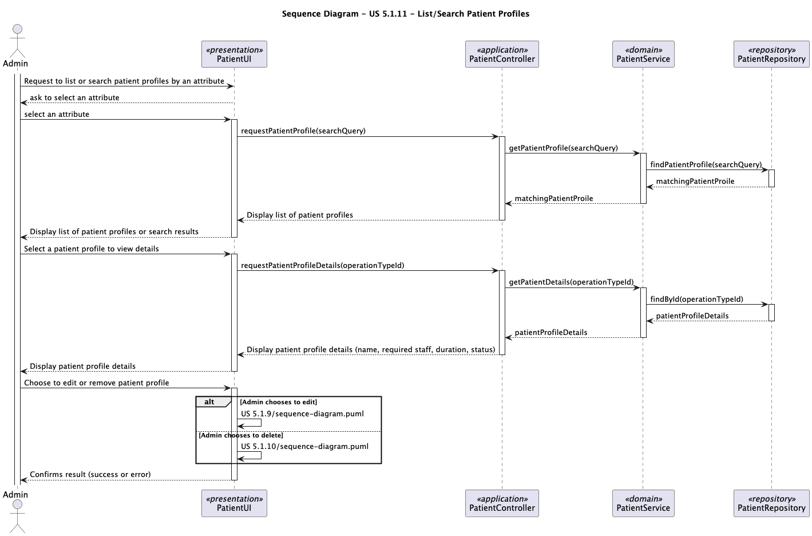

# US 5.1.11 - List/search patient profiles

## 1. Requirements Engineering

### 1.1. User Story Description

As an Admin,I want to list/search patient profiles by different attributes,so that I can view the details, edit, and remove patient profiles.

### 1.2. Customer Specifications and Clarifications

**From the specifications document:**

>

**Attributes**:
* First Name
* Last Name
* Full Name
* Date Of Birth
* Gender
* Medical Record Number
* Contact Information
* Allergies/ Medical Conditions
* Emergency Contact
* Appointment History

**Rules**:
* A patient must be unique in terms of Medical Record Number, Email and Phone.
* Sensitive data(like medical history)must comply with GDPR,allowing patients to control their data access.

**From the client clarifications:**

> **Question:**
>
> The document states "Some anonymized data may be retained for legal or research purposes, but all identifiable
    information is erased". Which information should be retained?
> **Answer:** It is part of the team's responsibility in the scope of the GDPR module to define the policy
> 
> **Question**
>
> What types of filters can be applied when searching for profiles?
> **Answer** Filters can include doctor specialization, name, or email to refine search results.

> **Question**
>
> * As discussed in a class, there are plenty of filters for the doctors profiles, however im struggling to see
    what filters can be applied to the patients profiles listing. They can be searched by name, email, date of birth, or medical
    record number, but everyone has the same role, no specialization, and so on. Can you be a bit more detailed on the filters
    you're looking to be applied in the patients listings?
> **Answer** Users should be able to search students by: name, AND/OR email, AND/OR phone number, AND/OR medical record number,
    AND/OR date of birth, AND/OR gender. Listing of users should have the same filters available.

### 1.3. Acceptance Criteria

* **AC1:** Admins can search patient profiles by various attributes, including name, email, date of birth, or medical record number.
* **AC2:** The system displays search results in a list view with key patient information (name, email, date of birth).
* **AC3:** Admins can select a profile from the list to view, edit, or delete the patient record.
* **AC4:** The search results are paginated, and filters are available to refine the search results.

### 1.4. Found out Dependencies

* There is a dependency with US 5.1.1 because for the admin to list patient profiles it is necessary that he´s already registered in the system.
* There is a dependency with US 5.1.8 because it´s necessary have patient profiles created so that is possible to list them.

### 1.5 Input and Output Data

**Input Data:**

* Typed Data:
    * The choosen attribute (name, email, dateOfBirth, medicalRecordNumber)
* Selection Data: 
    * Patient Profile 

**Output Data:**
  * List of attributes
  * List of patients
  * (In)Success of the operation.

### 1.6. System Sequence Diagram (SSD)

### 1.7. Sequence Diagram (SD)

### 1.8 Other Relevant Remarks
n\a

