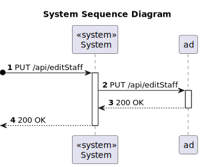

# US 5.1.13 - Edit staff profile

## 1. Requirements Engineering

### 1.1. User Story Description

As an Admin, I want to edit a staff’s profile, so that I can update their information.

### 1.2. Customer Specifications and Clarifications 

**From the specifications document:**

### `Attributes:`

   * Availability slots;
   * Specialization;
   * Phone Number;
   * Email.

### `Rules:`

  * A staff must be unique in terms of `License Number`, `Email` and ‘Phone’.
  * Staff define the availability slots, e.g. slot 1: 2024-09-25:14h00-18h00; slot2: 2024-09-25:19h00/2024-09-26:02h00.
  * The availability slots remain unchanged when appointments are used for an appointment.
  * Staff can handle multiple appointments but cannot be double-booked at the same time.

**From the client clarifications:**

> **Question:** 
> 
> **Answer:**

> **Question:**
>
> **Answer:**

> **Question:**
>
> **Answer:**

> **Question:**
>
> **Answer:**

### 1.3. Acceptance Criteria

* **AC1:** Admins can search for and select a staff profile to edit.
* **AC2:** Editable fields include contact information, availability slots, and specialization.
* **AC3:** The system logs all profile changes, and any changes to contact information trigger a confirmation email to the staff member.
* **AC4:** The edited data is updated in real-time across the system.

### 1.4. Found out Dependencies

* `This user story has a dependency with US 5.1.12, As an Admin, I want to create a new staff profile, so that I can add them to the 
hospital’s roster, because the staff profile must be created before it can be edited.`

### 1.5 Input and Output Data

**Input Data:**

* Typed data:
    * Availability slots;
    * Specialization;
    * Phone Number;
    * Email.

**Output Data:**

* The profile was edited successfully.

### 1.6. System Sequence Diagram (SSD)

### Sequence Diagram (SD)

### 1.7 Other Relevant Remarks

