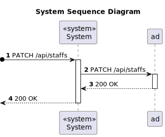
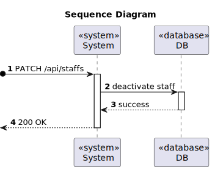

# US 5.1.14 - Deactivate staff profile

## 1. Requirements Engineering

### 1.1. User Story Description

As an Admin, I want to deactivate a staff profile, so that I can remove them from the hospital’s active roster without losing their historical data.

### 1.2. Customer Specifications and Clarifications 

**From the specifications document:**

### `Attributes:`

  * No atributtes.

### `Rules:`

  * The profile is deactivated but the historical data remains accessible.

**From the client clarifications:**

> **Question:** 
> 
> **Answer:**

> **Question:**
>
> **Answer:**

> **Question:**
>
> **Answer:**

> **Question:**
>
> **Answer:**

### 1.3. Acceptance Criteria

* **AC1:** Admins can search for and select a staff profile to deactivate.
* **AC2:** Deactivating a staff profile removes them from the active roster, but their historical data (e.g., appointments) remains accessible.
* **AC3:** The system confirms deactivation and records the action for audit purposes.

### 1.4. Found out Dependencies

* `This user story has a dependency with US 5.1.12, As an Admin, I want to create a new staff profile, so that I can add them to the
hospital’s roster, because the staff profile must be created before it can be deactivated.`

### 1.5 Input and Output Data

**Input Data:**

* Typed data:
    * No typed data.

**Output Data:**

* The profile was deactivated successfully.

### 1.6. System Sequence Diagram (SSD)

### Sequence Diagram (SD)

### 1.7 Other Relevant Remarks

