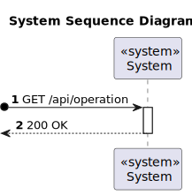
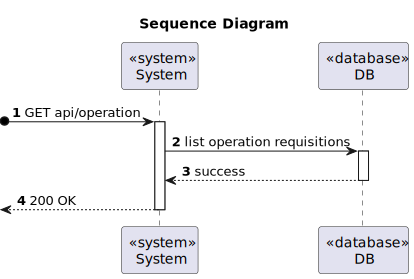

# US 5.1.19 - List operation requisitions

## 1. Requirements Engineering

### 1.1. User Story Description

As a Doctor, I want to list/search operation requisitions, so that I see the details, edit, and remove operation requisitions

### 1.2. Customer Specifications and Clarifications 

**From the specifications document:**

### `Attributes:`

  * Patient Name;
  * Operating Type;
  * Priority;
  * Status;

### `Rules:`

  * Doctors can search operation requests by patient name, operation type, priority, and status;

**From the client clarifications:**

> **Question:** When listing operation requests, should only the operation requests associated to the logged-in doctor be displayed? 
> 
> **Answer:** a doctor can see the operation requests they have submitted as well as the operation requests of a certain patient. an Admin will be able to list all operation requests and filter by doctor it should be possible to filter by date of request, priority and expected due date

> **Question:**
>
> **Answer:**

> **Question:**
>
> **Answer:**

> **Question:**
>
> **Answer:**

### 1.3. Acceptance Criteria

* **AC1:** Doctors can search operation requests by patient name, operation type, priority, and status.
* **AC2:** The system displays a list of operation requests in a searchable and filterable view.
* **AC3:** Each entry in the list includes operation request details (e.g., patient name, operation type, status).
* **AC4:** Doctors can select an operation request to view, update, or delete it.

### 1.4. Found out Dependencies

* `This user story has a dependency with US 5.1.16 As a Doctor, I want to request an operation, so that the Patient has access to the
  necessary healthcare, because to edit and delete an operation request, the doctor must have previously requested it.`

### 1.5 Input and Output Data

**Input Data:**

* Typed data:
  * Patient Name;
  * Operating Type;
  * Priority;
  * Status;

**Output Data:**

* The operation requisitions were edited successfully.
* The operation requisitions were deleted successfully.

### 1.6. System Sequence Diagram (SSD)

### Sequence Diagram (SD)

### 1.7 Other Relevant Remarks

