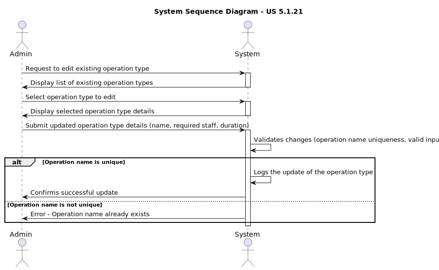
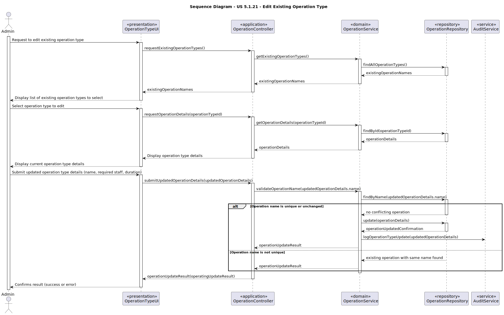

# US 5.1.21 - Edit existing types of operations

## 1. Requirements Engineering

### 1.1. User Story Description

As an Admin, I want to edit existing types of operations, so that I can update or correct information about the procedure.

### 1.2. Customer Specifications and Clarifications 

**From the specifications document:**

>	The system validates that the operation name is unique

>	The system logs the creation of new operation types and makes them available for scheduling immediately.

**From the client clarifications:**

> **Question:** Could you provide more details on how the attribute Required Staff by Specialisation in Operation Type works? Specifically, how is this list defined for each operation type? For example:
    - Are there specific rules or criteria that determine the essential staff for a procedure based on specialisation?

- Is the list fixed for each operation type, or is it dynamically determined based on the availability of staff or other factors?

- Should this attribute save Staff elements or should it focus on specialisations needed for the appointment type?
>
> **Answer:** please see the document https://moodle.isep.ipp.pt/mod/resource/view.php?id=233565

> **Question:** Regarding the required Staff, what is it? A list that defines the specializations and roles of the staff involved in the appointment? Like 2 heart doctors and 5 heart nurses?
>
> **Answer:** yes

> **Question:**  "The appointment type should match the staff’s specializations and room availability (...)". Can you explain this part of the project documentation? We'd assume that appointment type would be something like a consultation, a surgery or a meeting, and specialization would be Dermatology, Neurology, Pediatrics, etc... Is it supposed to match the operation type? Or that in itself is a different concept? Like Biopsy, Heart Surgery and so on...
>
> **Answer:** this system only deals with surgeries, thus the appointments are "scheduled surgeries". If the operation type indicates that an orthopedic doctor and nurse are needed, the scheduling cannot be done for staff that do not have that specialization

> **Question:** "Operations cannot exceed the estimated time unless rescheduled." is something stated in the project documentation. Can you explain this aspect of an operation appointment?
>
> **Answer:** basically, the planning module will schedule the operation for the average time of setup + surgery + cleaning. during normal operation of the hospital a surgery might take longer than expected which will then require a rescheduling of all other surgeries for that room and staff

> **Question:** In the project document it mentions that each operation has a priority. How is a operation's priority defined? Do they have priority levels defined? Is it a scale? Or any other system?
>
> **Answer:** Elective Surgery: A planned procedure that is not life-threatening and can be scheduled at a convenient time (e.g., joint replacement, cataract surgery). Urgent Surgery: Needs to be done sooner but is not an immediate emergency. Typically within days (e.g., certain types of cancer surgeries). Emergency Surgery: Needs immediate intervention to save life, limb, or function. Typically performed within hours (e.g., ruptured aneurysm, trauma).

### 1.3. Acceptance Criteria

* **AC1:** - Admins can search for and select an existing operation type to edit.
* **AC2:** - Editable fields include operation name, required staff by specialization, and estimated duration.
* **AC3:** - Changes are reflected in the system immediately for future operation requests.
* **AC4:** - Historical data is maintained, but new operation requests will use the updated operation type information.

### 1.4. Found out Dependencies

* This US depends on the US 5.1.20 'As an Admin, I want to add new types of operations, so that I can reflect the available medical procedures in the system.' because to be possible to edit types of operations they need to exist in the first place.

### 1.5 Input and Output Data

**Input Data:**

* Typed data:
    * Operation Name
    * Required Staff by Operation
    * Estimated Duration

**Output Data:**

* Log editing of existing operation types

### 1.6. Diagrams

#### 1.6.1 System Sequence Diagram

#### 1.6.1 System Sequence Diagram

### 1.7 Other Relevant Remarks

