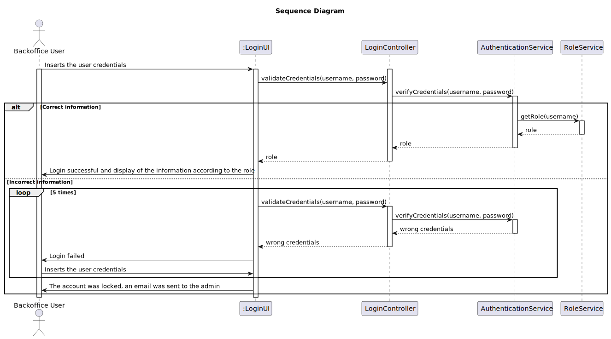

# US 5.1.6 - Log in non-autheticated Backoffice User

## 1. Requirements Engineering

### 1.1. User Story Description

As a (non-authenticated) Backoffice User, I want to log in to the system using my credentials, so that I can access the backoffice features according to my assigned role.

### 1.2. Customer Specifications and Clarifications 

**From the specifications document:**

### `Attributes:`
    * The user does not have specific attributes associated with the login itself, aside from the credentials (email and password).

### `Rules:`
    * The non-authenticated Backoffice User accesses the backoffice features using email and password.
    * Access is granted based on role-based permissions, limiting users to functionalities related to their specific role (e.g., doctor, nurse, admin).

**From the client clarifications:**

> **Question:** 
>
> **Answer:** 

### 1.3. Acceptance Criteria

* **AC1:** Backoffice users log in using their username and password.
* **AC2:** Role-based access control ensures that users only have access to features appropriate to their role (e.g., doctors can manage appointments, admins can manage users and settings).
* **AC3:** After five failed login attempts, the user account is temporarily locked, and a notification is sent to the admin.
* **AC4:** Login sessions expire after a period of inactivity to ensure security.

### 1.4. Found out Dependencies

* `No dependencies.`

### 1.5 Input and Output Data

**Input Data:**

* Typed data:
    * Email (username)
    * Password

**Output Data:**

* Successful login:

    - User is redirected to the appropriate dashboard based on their role.

    - Role-specific features are displayed.

* Failed login:

    - After five unsuccessful attempts, the account is locked, and an email is sent to the administrator.

* Session expired:

    - After a period of inactivity, the session expires, and the user is logged out.

### 1.6. System Sequence Diagram (SSD)

### 1.6 Sequence Diagram (SD)

### 1.7 Other Relevant Remarks

