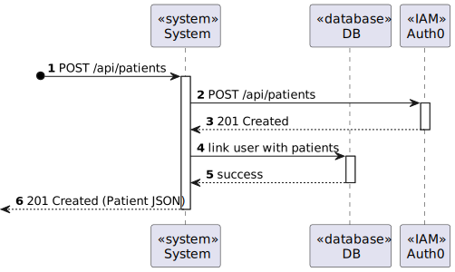

# US 5.1.7 - Log in Patient through an external IAM

## 1. Requirements Engineering

### 1.1. User Story Description

As a Patient, I want to log in to the healthcare system using my external IAM credentials, so that I can access my appointments, medical records, and other features securely.

### 1.2. Customer Specifications and Clarifications 

**From the specifications document:**

### `Attributes:`

    * 

### `Rules:`

    * The system must authenticate patients using an external IAM provider.
    * User sessions expire after a defined period of inactivity.
    * Only authenticated patients can access sensitive information, such as medical records and appointment history.

**From the client clarifications:**

> **Question:** In IAM external system, if a patient is signed in with a google account and later uses other external system like Facebook, and both have different credentials, what happens?
>
> **Answer:** assume the system only supports one IAM.

> **Question:** 
>
> **Answer:**

> **Question:**
>
> **Answer:**

> **Question:**
>
> **Answer:**

### 1.3. Acceptance Criteria

* **AC1:** Patients log in via an external Identity and Access Management (IAM) provider (e.g., Google, Facebook, or hospital SSO).
* **AC2:** After successful authentication via the IAM, patients are redirected to the healthcare system with a valid session.
* **AC3:** Patients have access to their appointment history, medical records, and other features relevant to their profile.
* **AC4:** Sessions expire after a defined period of inactivity, requiring reauthentication.

### 1.4. Found out Dependencies

* `Dependencies with US 5.1.3. As a Patient, I want to register for the healthcare application, so that I can create a user profile and book appointments online, since a patient needs to be register to be able to login in the healthcare aplication.`

### 1.5 Input and Output Data

**Input Data:**

* Typed data:
    * Email (username)
    * Password

**Output Data:**

* Appointment history, medical records and other features.

### 1.6. System Sequence Diagram (SSD)

#### Alternative One

### 1.7 Other Relevant Remarks

