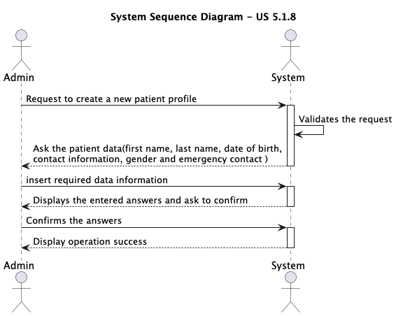
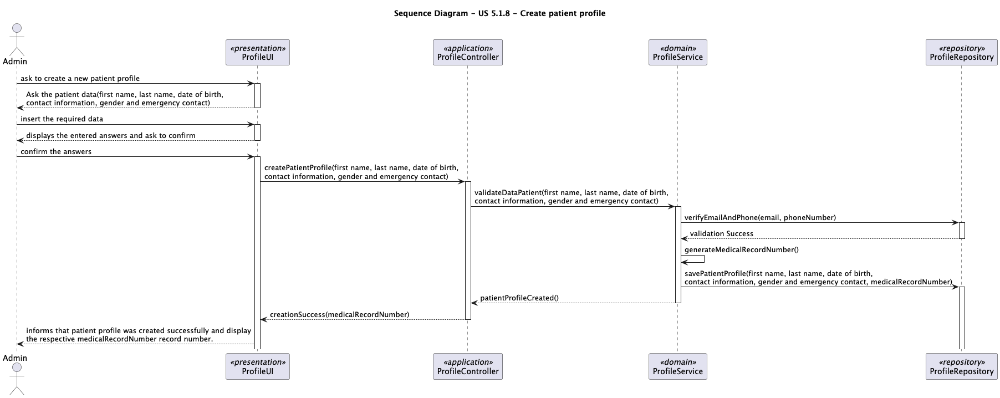

# US 5.1.8 - Create a new patient profile

## 1. Requirements Engineering

### 1.1. User Story Description

As and Admin, I want to create a new patient profile, so that I can register their personal details nd medical history.

### 1.2. Customer Specifications and Clarifications

**From the specifications document:**

>

**Attributes**:
* First Name
* Last Name
* Full Name
* Date Of Birth 
* Gender
* Medical Record Number
* Contact Information
* Allergies/ Medical Conditions
* Emergency Contact
* Appointment History

**Rules**:
* A patient must be unique in terms of Medical Record Number, Email and Phone.
* Sensitive data(like medical history)must comply with GDPR,allowing patients to control their data access.

**From the client clarifications:**

> **Question1:**
>
> Dear client,
When an Admin creates a patient profile, should he already register them in the system, as users that can login, or should the registration always be responsibility of the patient?
If the latter is intended, should the patient's user credentials be linked to the existing profile?
Best regards, Tiago Brito
> **Answer1:** this was already clarified in a previous meeting.
registering a patient record is a separate action from the patient self-registering as a user

> **Question1.1** 
> 
>That's right, it was clarified in a previous meeting, but I'm still not 100% clarified about my question.
I understand that the Admin can create the Pacient profile and leave the User as inactive, but how does the activation happen? If that pacient eventualy wants to register himself, should there be an option to activate an existing profile? For example, associate the e-mail from registration input with the existing profile's e-mail?
The feature 5.1.3 asks for the full registration, but doesn't say anything about profiles that already exist.
> **Answer1.1** the admin register the patient (this does not create a user for that patient)
optionally, the patient self-registers in the system by providing the same email that is currently recorded in their patient record and the system associates the user and the patient
there is no option for someone who is not a patient of the system to register as a user
hope this is the clarification you were missing. if not, let me know.

> **Question2**
> 
> It is specified that the admin can input some of the patient's information (name, date of birth, contact information, and medical history).
Do they also input the omitted information (gender, emergency contact and allergies/medical condition)?
Additionally, does the medical history that the admin inputs refer to the patient's medical record, or is it referring to the appointment history?
> **Answer** the admin can not input medical history nor allergies. they can however input gender and emergency contact

### 1.3. Acceptance Criteria

* **AC1:** Admins can input patient details such as first name, last name, date of birth, contact information, and medical history.
* **AC2:** A unique patient ID (Medical Record Number) is generated upon profile creation.
* **AC3:** The system validates that the patient’s email and phone number are unique.
* **AC4:** The profile is stored securely in the system, and access is governed by role-based permissions.

### 1.4. Found out Dependencies
  
  * There is a dependency with US 5.1.1. because for an admin to create a patient it is necessary that he is already registered in the system.

### 1.5 Input and Output Data

**Input Data:**

* Typed data:
    * First Name
    * Last Name
    * Date Of Birth 
    * Contact Information
    * Gender
    * Emergency Contact 

**Output Data:**
* Medical Record Number
* (In)Success of the operation.

### 1.6. System Sequence Diagram (SSD)

### 1.7. Sequence Diagram (SD)

### 1.8 Other Relevant Remarks
n\a

