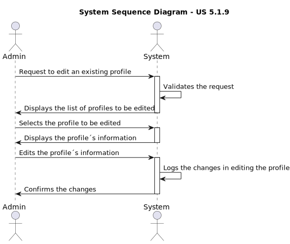
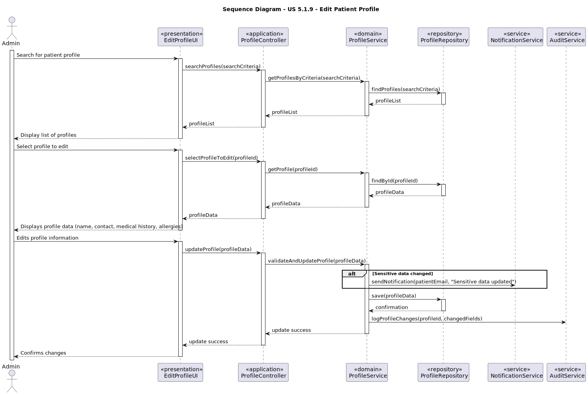

# US 5.1.9 - Edit existing patient

## 1. Requirements Engineering

### 1.1. User Story Description

As an Admin, I want to edit an existing patient profile, so that I can update their information when needed.

### 1.2. Customer Specifications and Clarifications 

**From the specifications document:**

>	Represents individuals receiving medical care.

>       Attributes:
o `First Name`
o `Last Name`
o `Full Name`
o `Date of Birth`
o `Gender`
o `Medical Record Number` (unique identifier)
o `Contact Information` (email, phone)
o `Allergies/Medical Conditions` (optional)
o `Emergency Contact`
o `Appointment History` (list of previous and upcoming appointments)

>       Rules:
    A patient must be unique in terms of `Medical Record Number`, `Email` and ‘Phone’.
    Sensitive data (like medical history) must comply with GDPR, allowing patients to control their data access.

**From the client clarifications:**

> **Question:** Regarding the editing of patient information, is contact information the only sensitive data? Is it the only data that triggers an email notification?
>
> **Answer:** faz parte das vossas responsabilidades no âmbito do módulo de proteçãod e dados e de acordo com a politica que venham a definir

> **Question:** In this US an admin can edit a user profile. Does the system display a list of all users or the admin searchs by ID? Or both?
>
>**Answer:** this requirement is for the editing of the user profile. from a usability point of view, the user should be able to start this feature either by searching for a specific user or listing all users and selecting one. note that we are not doing the user interface of the system in this sprint.

### 1.3. Acceptance Criteria

* **AC1:** Admins can search for and select a patient profile to edit.
* **AC2:** Editable fields include name, contact information, medical history, and allergies.
* **AC3:** Changes to sensitive data (e.g., contact information) trigger an email notification to the patient.
* **AC4:** The system logs all profile changes for auditing purposes.

### 1.4. Found out Dependencies

* This User Story depends on US 5.1.8, 'As an Admin, I want to create a new patient profile, so that I can register their personal details and medical history.', because to be possible to edit a patient profile, it needs to exist in the first place.

### 1.5 Input and Output Data

**Input Data:**

* Typed data:
    * Name
    * Contact Information
    * Medical History
    * Allergies

**Output Data:**

* (In)Success of the operation
* Email Notification to the patient
* Log profile changes

### 1.6. Diagrams

#### 1.6.1. System Sequence Diagram

#### 1.6.2. Sequence Diagram

### 1.7 Other Relevant Remarks

