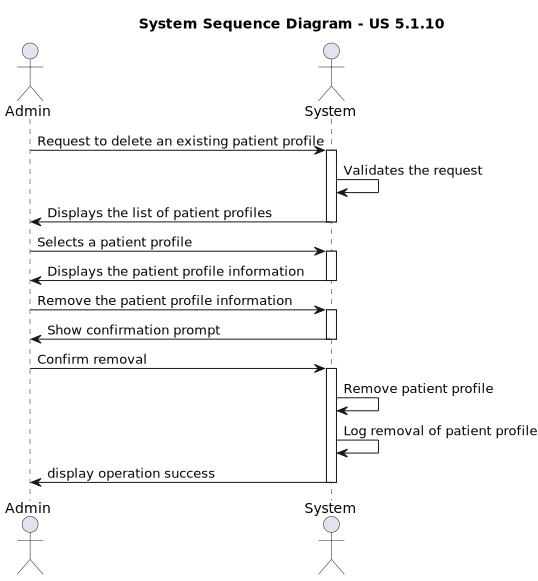
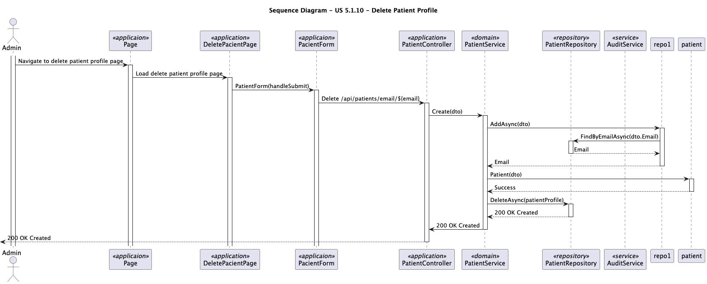

# US 5.1.10 - Delete Patient Profile

## 1. Requirements Engineering

### 1.1. User Story Description

As an Admin,I want to delete a patient profile,so that I can remove patients who are no longer under car.

### 1.2. Customer Specifications and Clarifications

**From the specifications document:**

>

**Attributes**:
* First Name
* Last Name
* Full Name
* Date Of Birth
* Gender
* Medical Record Number
* Contact Information
* Allergies/ Medical Conditions
* Emergency Contact
* Appointment History

**Rules**:
* A patient must be unique in terms of Medical Record Number, Email and Phone.
* Sensitive data(like medical history)must comply with GDPR,allowing patients to control their data access.

**From the client clarifications:**

> **Question:** What happens to patient data after the profile is deleted?
> 
> **Answer:** Patient data must be retained for a legally mandated period before being anonymized or deleted.
> 
>  **Question:** * As I understand it, a patient's profile has plenty of information about the user, such as name, contact information
(phone and email), preferences, appointment history, medical records, etc. What data do you consider to be identifiable? Are
medical and appointment records deemed identifiable from your perspective? What data from the user's profile can be retained
in the system after the legal time frame related to the GDPR has passed? Also, how much time do you want to be set as the time
frame for deletion and retention of data in the system? Is the user informed on how many days are left for the deletion of its
data? Like by email or somewhere in the UI of their account?
> **Answer** It is part of the team's work for the GDPR module to define the policy.
> 
> **Question:** * Gostávamos de perguntar se na funcionalidade que pretende que envolve remover o perfil de pacientes que já não
se encontram a receber ajuda ou tratamento da entidade hospitalar (5.1.10) se quando é mencionado "(...)all patient data
is permanently removed from the system within a predefined time frame." se o tempo predefinido é do sistema em si ou se é
definido pelo admin que apaga os dados.
> 
> **Answer:** Faz parte das vossas responsabilidades no âmbito do módulo de proteçãod e dados e de acordo com a politica
que venham a definir.

### 1.3. Acceptance Criteria

* **AC1:** Admins can search for a patient profile and mark it for deletion.
* **AC2:** Before deletion, the system prompts the admin to confirm the action.
* **AC3:** Once deleted, all patient data is permanently removed from the system within a predefined time frame.
* **AC4:** The system logs the deletion for audit and GDPR compliance purposes.

### 1.4. Found out Dependencies
  
  * There is a dependency with US 5.1.1 because it´s necessary that the patient is registered in the system so that the admin can request the deletion of the patient profile.
  * There is a dependency with US 5.1.8 because the patient profile must be registered in the system so that the admin can request the deletion of the patient profile.

### 1.5 Input and Output Data

**Input Data:**

* Selected data:
    * Patient Profile
   

**Output Data:**
* List of patients profile
* Confirm Removal
* (In)Success of the operation

### 1.6. System Sequence Diagram (SSD)

### 1.7. Sequence Diagram (SD)

### 1.8. Class Diagram(CD)

### 1.9 Other Relevant Remarks

